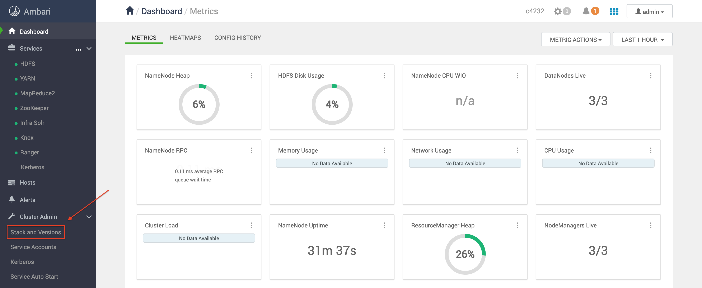
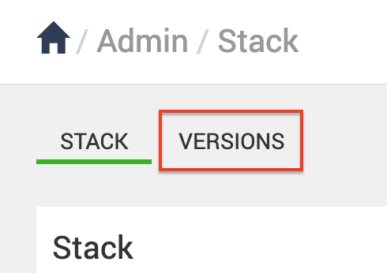
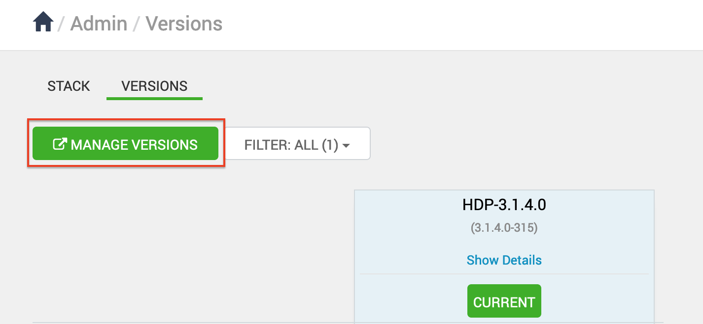
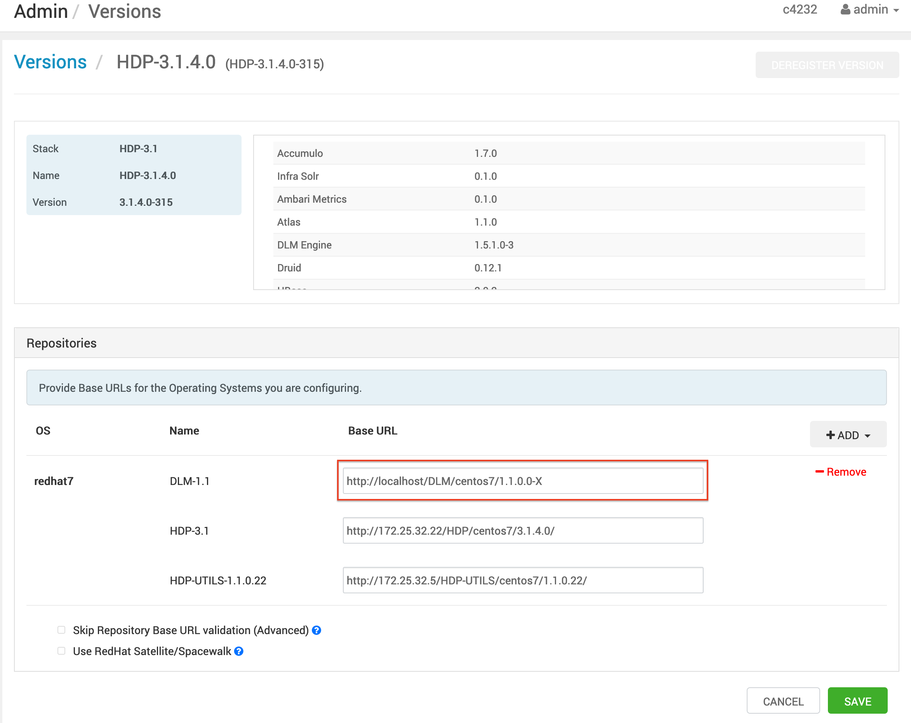

# How to install DLM engine in HDP (3.x)

## Prerequisites
Check out the [Hortonworks Support matrix](https://supportmatrix.hortonworks.com/) for supported DLM version and download the following files:
1. DLM engine or _beacon_ mpack. It looks something like this: `beacon-ambari-mpack-1.5.1.0-3.tar.gz`
2. DLM engine RPM tarball. It should be similar to: `DLM-1.5.1.0-3-centos7-rpm.tar.gz`

## Install the mpack
Place the beacon mpack in the Ambari server host and install it:
```
ambari-server install-mpack mpack=<mpack-tar.gz>
```
For example: ```ambari-server install-mpack mpack=beacon-ambari-mpack-1.5.1.0-3.tar.gz```

## Set up a local repository for DLM engine package
1. Install and start HTTPD service:
``` yum install -y httpd
 systemctl start httpd
```

2. Copy and extract the DLM engine mpack tarball in `/var/www/html`:
``` mv /opt/DLM-1.5.1.0-3-centos7-rpm.tar.gz /var/www/html
 tar xf DLM-1.5.1.0-3-centos7-rpm.tar.gz
```

3. Browse to the HTTPD page and verify if you can access the repository at:
_http://local-repository-host:default-http-port/DLM/centos7/1.5.1.0/_

## Set up Postgres DB for DLM engine
1. Install and configure Postgres JDBC driver:
```shell
yum install postgresql-jdbc -y && chmod 644 /usr/share/java/postgresql-jdbc.jar && ambari-server setup --jdbc-db=postgres --jdbc-driver=/usr/share/java/postgresql-jdbc.jar
```

1. Login to _psql_ as postgres user:
```shell
su - postgresql
psql
```

2. Create role, DB, and set privileges:
```sql
CREATE USER beacon WITH PASSWORD 'bigdata';
CREATE DATABASE beacon;
GRANT ALL PRIVILEGES ON DATABASE beacon TO beacon;
```
Where `beacon` is the database user, _bigdata_ is the database password, and `beacon` is the DB itself.

To configure a MySQL DB, check out [Configure MySQL Database for DLM engine](https://docs.cloudera.com/HDPDocuments/DLM1/DLM-1.5.1/installation/content/dlm_configure_mysql_external_database.html)

3. Configure Postgres so that DLM engine can access the database:
```shell
echo "local beacon      beacon trust
host all  beacon 0.0.0.0/0 trust
host all  beacon ::/0 trust" >> /var/lib/pgsql/9.6/data/pg_hba.conf
```

4. Reload PostgreSQL settings:
```
su postgres -c '/usr/pgsql-9.6/bin/pg_ctl -D /var/lib/pgsql/9.6/data/ reload'
```

## Add DLM Engine service in Ambari

1. Click on Stack and Versions:



2. Go to the Versions tab:



3. Click on Manage Versions and select the relevant HDP version:



4. Update the DLM repository with your local repository URL:



5. Go to Add service and add DLM. Update the following properties during DLM engine installation:
* beacon_database: _org.postgresql.Driver_
* beacon_principal
* beacon_store_db_name: _beacondb_
* beacon_store_url: _jdbc:postgresql://db-hostname:5432/beacondb_
* beacon_store_user: _beacon_
* beacon_store_password: _bigdata_
