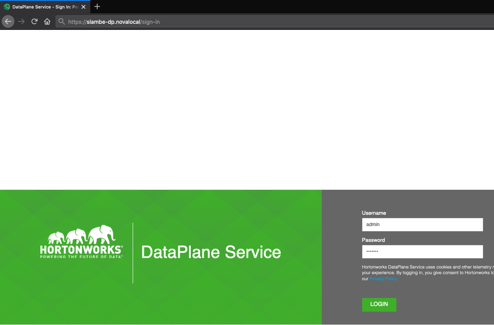
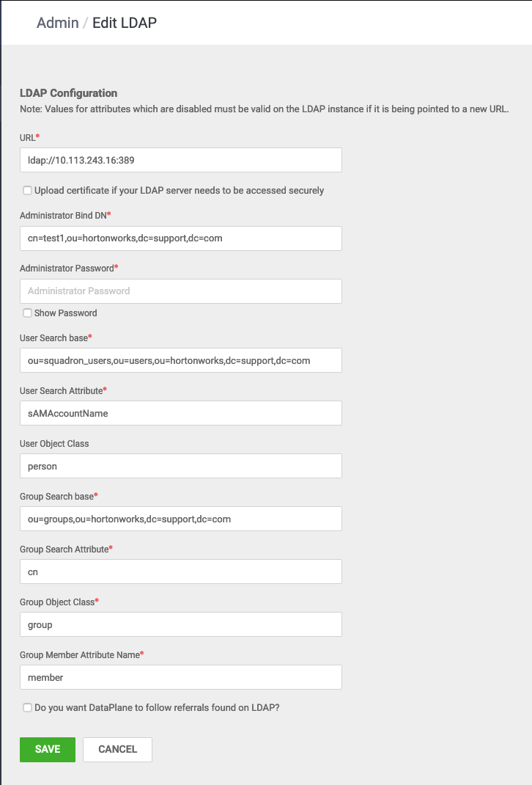

# DataPlane setup

Download and run this bash [script](https://gitlab.com/-/snippets/2109023) to install docker and continue from [here](https://gitlab.com/saurabhlambe/DataPlane-stuff/-/blob/master/How%20to%20install%20DataPlane.md#b-installing-dataplane) or follow these steps:

## A. Install and setup docker
### 1. Remove old versions
```bash
yum remove docker \
       docker-client \
       docker-client-latest \
       docker-common \
       docker-latest \
       docker-latest-logrotate \
       docker-logrotate \
       docker-engine
```
### 2. Setup the repo
```bash
yum install -y yum-utils device-mapper-persistent-data lvm2
yum-config-manager --add-repo https://download.docker.com/linux/centos/docker-ce.repo
```
### 3. Install Docker engine
```bash
yum install docker-ce docker-ce-cli containerd.io -y
```
### 4. Start Docker and verify if Docker engine is running
```bash
systemctl start docker
docker run hello-world
```

## B. Installing DataPlane

### 1. Disable SELINUX
```bash
setenforce 0
sed -i 's/^SELINUX=.*/SELINUX=disabled/g' /etc/sysconfig/selinux
```

### 2. Download and extract the DataPlane tarball
```bash
wget http://xxxxxxxxxxxxxxxxxxx/DP-1.3.0.0-76-centos7-rpm.tar.gz
tar xvf DP-1.3.0.0-76-centos7-rpm.tar.gz
```

### 3. Install dp-select and dp-core services
```bash
cd DP/centos7/1.3.0.0/dp-select
rpm -ivh dp-select-1.3.0.0-76.noarch.rpm
cd ../dp_core
rpm -ivh dp-core_1_3_0_0_76-1.7.0.1.3.0.0-76.noarch.rpm
```
### 4. Install and setup Postgres database
#### a. Install Postgres 9.6 in CentOS7
```bash
yum install https://download.postgresql.org/pub/repos/yum/9.6/redhat/rhel-7-x86_64/pgdg-redhat-repo-latest.noarch.rpm -y
yum install postgresql96 postgresql96-server postgresql96-contrib postgresql96-libs -y
/usr/pgsql-9.6/bin/postgresql96-setup initdb
systemctl enable postgresql-9.6.service
systemctl start  postgresql-9.6.service
```
#### b. Set up DataPlane DB
```bash
su - postgres
psql
CREATE DATABASE dataplane;
CREATE USER dataplane WITH PASSWORD 'bigdata';
GRANT ALL PRIVILEGES ON DATABASE dataplane TO dataplane;
```
#### c. Allow permissions for all users/hosts to access DB
```bash
tail /var/lib/pgsql/9.6/data/pg_hba.conf -n15

# "local" is for Unix domain socket connections only
local   all             all                                     md5
# IPv4 local connections:
host    all             all             127.0.0.1/32            trust
# IPv6 local connections:
host    all             all             ::1/128                 trust
# Allow replication connections from localhost, by a user with the
# replication privilege.
#local   replication     postgres                                peer
#host    replication     postgres        127.0.0.1/32            ident
#host    replication     postgres        ::1/128                 ident
local all dataplane trust
host all dataplane 0.0.0.0/0 trust
host all dataplane ::/0 trust
```
#### d. Allow all addresses to listen
```bash
grep listen_addresses /var/lib/pgsql/9.6/data/postgresql.conf
listen_addresses = '*'		# what IP address(es) to listen on;
```
#### e. Restart postgres-9.6
```bash
systemctl restart postgresql-9.6.service
```

### 5. Edit config.env.sh
```bash
cat /usr/dp/current/core/bin/config.env.sh
--
# DB Configs
# 'yes' if external database is required
USE_EXTERNAL_DB="yes"

# JDBC URL for connecting to the external database. Change host_name and port and database name as required. Uncomment when 'USE_EXTERNAL_DB' is set to 'yes'.
DATABASE_URI="jdbc:postgresql://172.26.96.54:5432/dataplane"

# Uncomment below line if SSL connection is required
# DATABASE_URI="jdbc:postgresql://host_name:5432/dataplane?ssl=true&sslfactory=org.postgresql.ssl.NonValidatingFactory"

DATABASE_USER="dataplane"
DATABASE_PASS="bigdata"
```

### 6. Deploy the DataPlane service
```bash
cd /usr/dp/1.3.0.0-76/core/bin
# Get the DP host machine IP and keep it handy
hostname -i
./dpdeploy.sh load
# After successful execution, it should say:
# Docker image loading complete. Starting DataPlane setup..
./dpdeploy.sh init --all
# Setup the default 'admin' user. This user is for initial setup of DataPlane, including configuration of LDAP and adding additional DPS Admins.
# Enter a password for this 'admin' 'user:

# Enter master password for DataPlane Service (Minimum 6 characters long):

# Initialization and start complete.
```

### 7. Access DP in the browser using its IP address or hostname and log in as *admin* user


### 8. Go to Users > LDAP settings and enter relevant information

